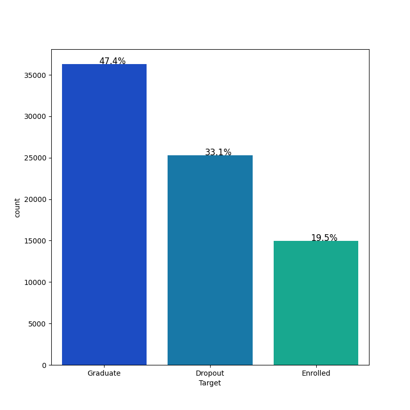

# Statistical Analysis of Kaggle Classification Dataset

This project presents a comprehensive statistical analysis of the Kaggle classification dataset, examining various relationships, hypothesis tests, and visualizations across different variables. The analysis covers multiple aspects of the dataset, including both categorical and numerical features, and performs hypothesis testing to draw meaningful insights.

## Table of Contents

- [Overview](#overview)
- [Data Exploration](#data-exploration)
- [Hypothesis Testing](#hypothesis-testing)
  - [1. Admission Grade vs Target](#admission-grade-vs-target)
  - [2. Marital Status vs Target](#marital-status-vs-target)
  - [3. GDP vs Unemployment Rate](#gdp-vs-unemployment-rate)
  - [4. GDP vs Inflation Rate](#gdp-vs-inflation-rate)
- [Correlation Analysis](#correlation-analysis)
- [Conclusion](#conclusion)

## Overview

This analysis aims to uncover significant patterns in the dataset related to various features such as Admission grade, Marital status, GDP, and Unemployment rate. By employing statistical methods like One-way ANOVA and Chi-square tests, we draw insights into relationships between categorical and numerical variables.

The dataset contains different features, some of which are continuous (e.g., GDP, Unemployment rate), and some are categorical (e.g., Gender, Marital status). We utilize data visualization techniques to better understand the distribution and associations of these variables.

## Data Exploration

### Data Overview

The dataset contains multiple features including both categorical and numerical data. We start by reviewing the general statistics and the distribution of each feature.

## Importing Libraries
```python
import pandas as pd
import numpy as np
import matplotlib.pyplot as plt
import seaborn as sns
import scipy.stats as stats
from sklearn.model_selection import train_test_split
```

##  Data Information
```python
df.info()
df.describe(include='all')
```

# Null Values in Data
```python
df.isnull().sum()
```

# Describe Numerical Columns
```python
df.describe(include = ['int64']).T
```
# Exploratory Data Analysis
```python
def bar_plot(plot, feature):
    '''
    plot
    feature: categorical feature
    the function won't work if a column is passed in hue parameter
    '''
    total = len(feature) # length of the column
    for p in ax.patches:
        percentage = '{:.1f}%'.format(100 * p.get_height()/total) # percentage of each class of the category
        x = p.get_x() + p.get_width() / 2 - 0.05 # width of the plot
        y = p.get_y() + p.get_height() + 0.5         # height of the plot
        ax.annotate(percentage, (x, y), size = 24) # annotate the percentage
    plt.show() # show the plot
```


## Q 1 : is there a significant difference between Admission grade and Target variable?

```python
import matplotlib.pyplot as plt
import seaborn as sns
from google.colab import files

# Create a boxplot
plt.figure(figsize=(10, 6))
sns.boxplot(x='Target', y='Admission grade', data=df)

# Add plot title and labels
plt.title('Distribution of Admission Grade by Target')
plt.xlabel('Target')
plt.ylabel('Admission Grade')

# Save the plot before showing it
plt.savefig("/content/plot_1.png", format='png')

# Show the plot (optional)
plt.show()

# Close the figure to free memory
plt.close()

# Download the saved file
files.download('/content/plot_1.png')
```


